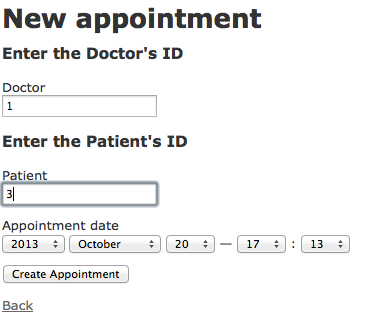
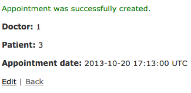

The Doctor's Office
===================

A Ruby on Rails Sample App
--------------------------

By Robin Swenson-Healey

Description
-----------

This app showcases *has_many :through* which is most useful in -ment or -ship relationships (ie: Enrollment, Assignment, Fellowship, Membership).  This app connects *Doctors* to *Patients* through *Appointments*.  Appointments function as a join table.

To create an appointment:
-------------------------

Seen completed:
---------------

Created Oct, 2013
